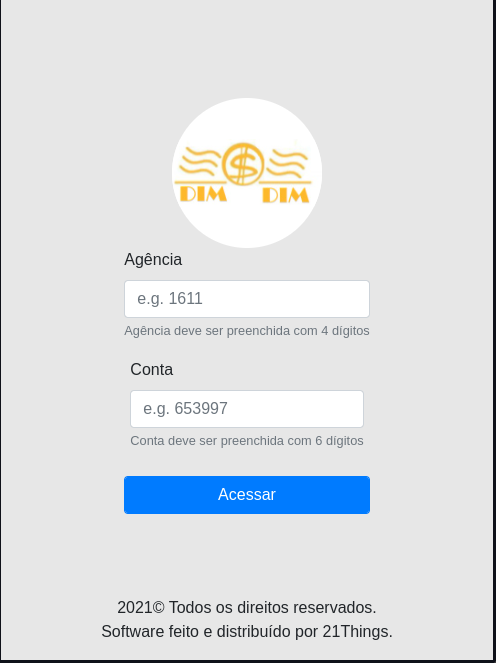
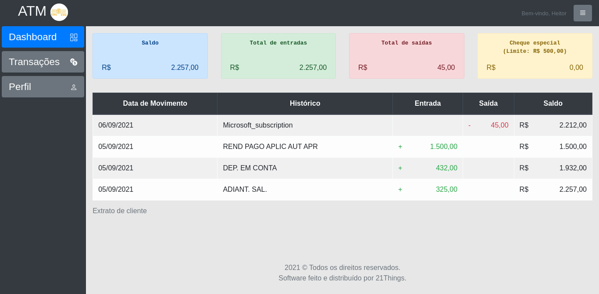
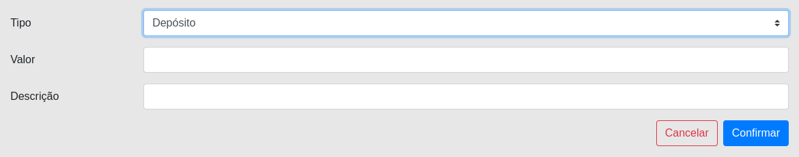
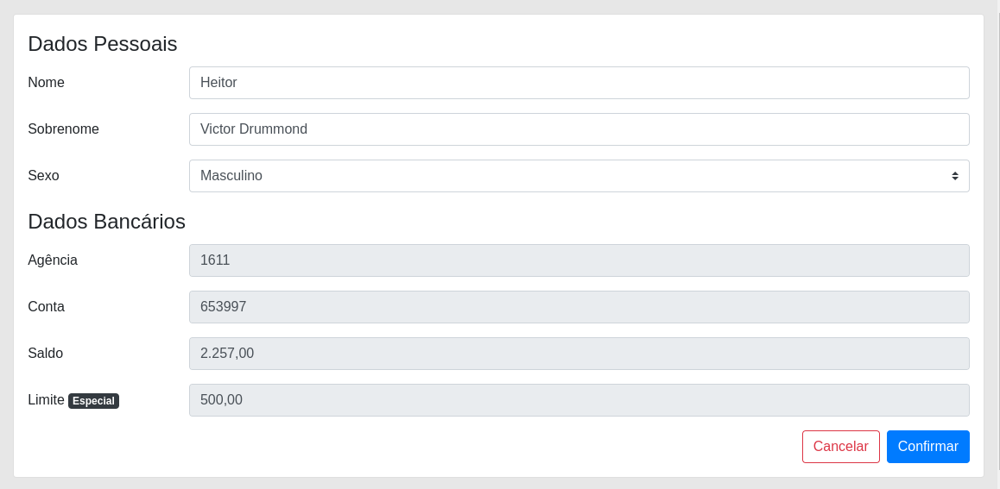
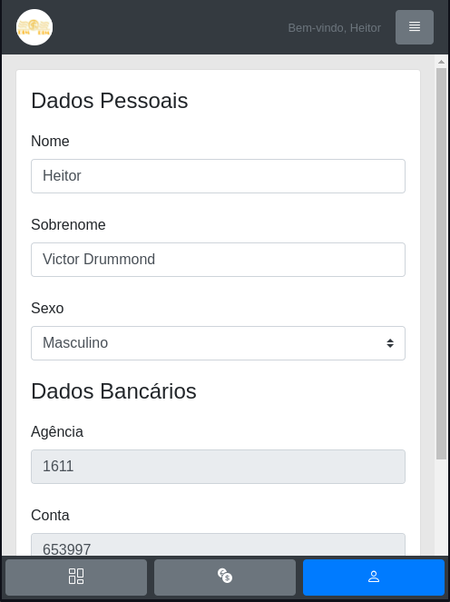

# DevOps CP04 - ATM Dim Dim

<div align="center">
<h3>ATM representa uma simulação de serviços bancários</h3>

<h4>&#x1F6A7; Projeto em construção &#x1F6A7;</h4>

<p>


<a href="https://github.com/ozluuh/devops-cp-dimdim-atm/blob/main/LICENSE">
    
</a>
</p>
</div>

## Tabela de conteúdos

- [Sobre](#sobre)
- [Funcionalidades](#funcionalidades)
- [Como executar](#como-executar)
  - [Pré-requisitos](#pré-requisitos)
    - [Preparando o ambiente](#preparando-o-ambiente)
    - [Executando a aplicação](#executando-a-aplicação)
- [API](#api)
- [Tecnologias](#tecnologias)
- [Screenshots](#screenshots)
- [Como contribuir](#como-contribuir)
- [Autor](#autor)
- [Licença](#licença)

## Sobre

**ATM Dim Dim** (Attending Machine) representa uma simulação de serviços bancários.

Projeto desenvolvido para simular a criação de um ambiente de produção no azure proposto pela disciplina de **DevOps Tools e Cloud Computing** para ser realizado em **1 semana** durante o ano letivo de **2021** na instituição **FIAP - Faculdade de Informática e Administração Paulista**.

## Funcionalidades

- [x] **Dashboard:** painel visual com informações centralizadas da conta.
  - [x] **Extrato:** transações realizadas;
  - [x] **Indicadores:** resumo da conta;
  - [ ] **Métricas:** gráficos analíticos da conta;
- [ ] **Transações:** serviços bancários disponíveis ao cliente.
  - [x] **Saque:** simula a transação de saque bancário;
  - [x] **Depósito:** simula a transação de depósito bancário;
  - [ ] **Transferência:** simula a transação de transferência entre contas de clientes.
- [x] **Perfil:** dados pessoais e bancários de cliente.
- [ ] **Abertura de conta:** abertura de conta bancária;

&#x1F4A1; abertura de conta disponível apenas via **API**.

## Como executar

Este projeto é dividido em duas partes

1. Backend (pasta `src/main/java`)
2. Frontend (pasta `src/main/resources/templates`)

Ambos executam assim que iniciado o processo no seu **editor de código** ou pela **CLI** do `maven`.

### Pré-requisitos

Antes de começar, você vai precisar ter instalado em sua máquina as seguintes ferramentas:

- **Git:** para clonar este repositório na sua máquina;
- **Java Development Kit (JDK):** para conseguir compilar e executar o projeto;
- **Oracle SQL:** banco de dados relacional, responsável por armazenar todas as informações do sistema;
- **Visual Studio Code:** Editor de código utilizada para desenvolver este projeto **ou qualquer outro de sua preferência**.

#### Preparando o ambiente

Após instalar e configurar as ferramentas de sua preferência, ao executar a aplicação pela primeira vez, será criada a estrutura de tabelas necessárias. Para visualizá-las acesse o seguinte diretório `src/main/resources/schema.sql`

&#x1F4A1; Você pode alimentar manualmente a base de dados, executando o script `src/main/resources/data.sql`.

#### Executando a aplicação

- Clone este repositório
  ```bash
  # HTTPS
  git clone https://github.com/ozluuh/devops-cp-dimdim-atm.git
  # or with SSH
  git clone git@github.com:ozluuh/devops-cp-dimdim-atm.git
  ```
- Abra no seu editor de código de sua escolha;
- Abra o arquivo **AtmApplication.java** e execute;
- Abra o navegador no endereço `http://localhost:8080/login`;
- Por fim, realize os testes &#x1F603;

&#x1F4A1; As credenciais de acesso devem ser cadastradas previamente via _API_ ou _manualmente pela base de dados_.

## API

Para conferir o funcionamento da API, verifique a documentação [aqui](./docs/API.md).

## Tecnologias

As seguintes ferramentas foram usadas na construção do projeto:

- HTML5
- CSS3
- Bootstrap 4.x
- JQuery 3.x
- Spring Boot + Thymeleaf

**Utilitários**

- Editor de código: [Visual Studio Code](https://code.visualstudio.com/Download)
- Ícones: [Bootstrap Icons](https://icons.getbootstrap.com/)
- Geral: [Favicon Generator](https://realfavicongenerator.net/)
- Cliente API: [Insomnia](https://insomnia.rest/download)

## Screenshots

<figure align="center">
  
  <figcaption>Login</figcaption>
</figure>

<figure align="center">
  
  <figcaption>Dashboard</figcaption>
</figure>

<figure align="center">
  
  <figcaption>Transações/Serviços</figcaption>
</figure>

<figure align="center">
  
  <figcaption>Perfil</figcaption>
</figure>

<figure align="center">
  
  <figcaption>Perfil: mobile</figcaption>
</figure>

## Como contribuir

1. Faça o **fork** do projeto;
2. Realize as alterações e envie um **pull request**.

## Autor

<a href="https://github.com/ozluuh" target="_blank" rel="noopener noreferrer">
  
</a>

[](www.linkedin.com/in/ozluuh)
[](https://github.com/ozluuh)

## Licença

[MIT](./LICENSE) &copy; [21 Things](https://github.com/ozluuh)
